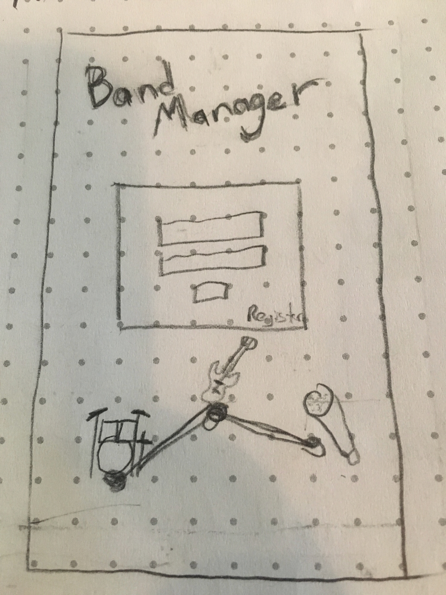
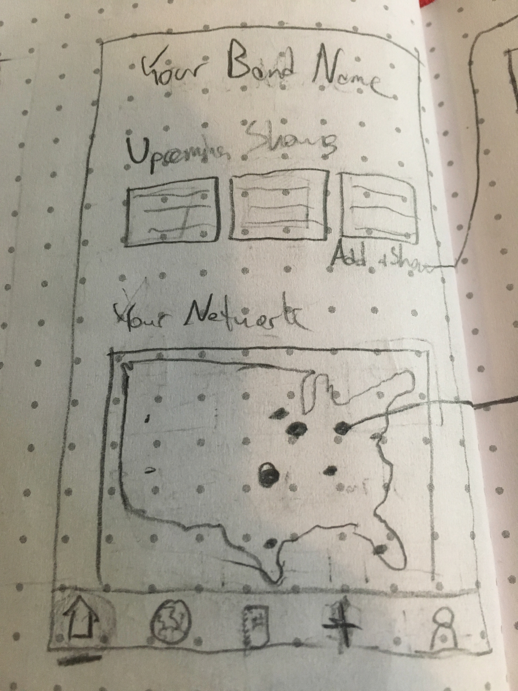
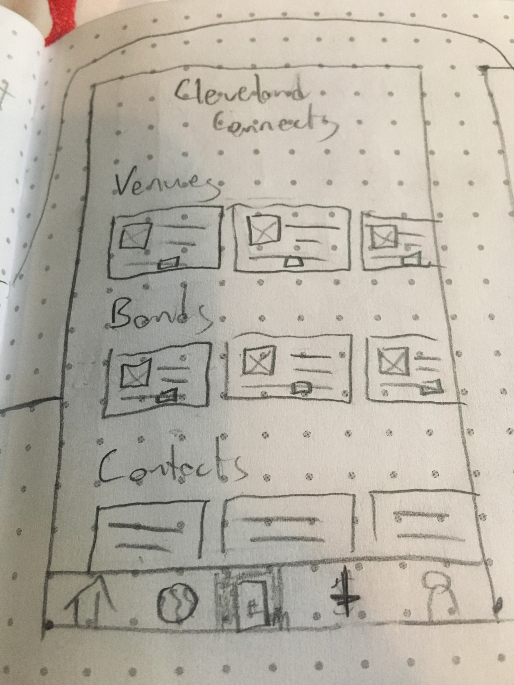
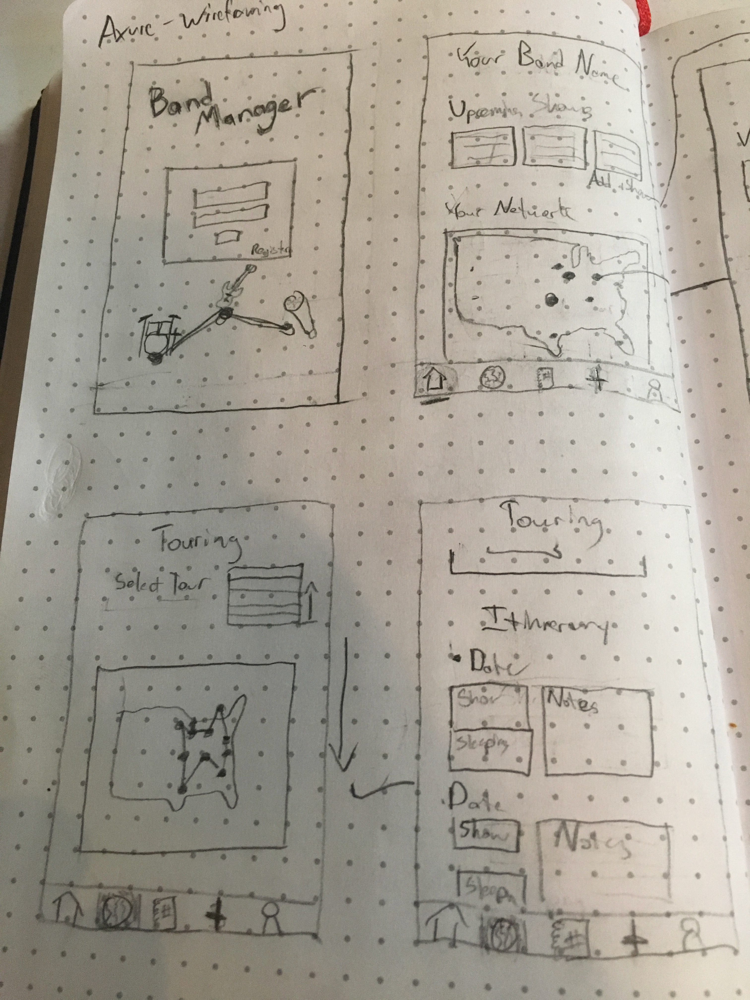
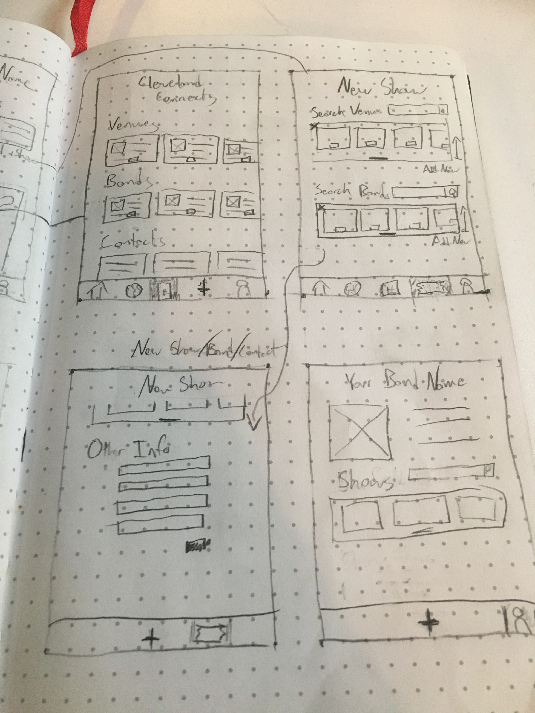
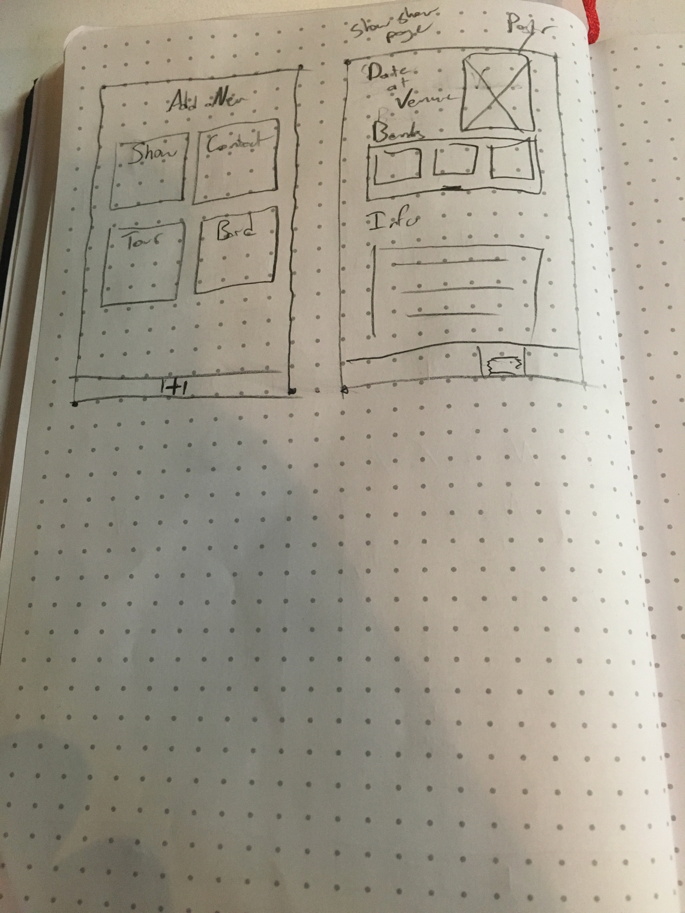

# Band Manager App

## User Stories

#### A user gets to the website for the first time
```
	User hits the register button on the splash screen,
	User enters their information and hits register
	User is redirected to their home screen
```
#### A user has registered before and is on the splash screen
```
	User enters username and password
	User is redirected to their home screen
```
#### A user is logged in on the homescreen
```
	User can see a scrollable list up upcoming show cards
	Each card is clickable and will take the user to a show show page

	User can click on add a show and is redirected the new show page

	User can see a map of USA with pins in each city that they have connections
	Pins vary in size to visually show their number of connections in an an area
	Pins are clickable and will bring the user to a connections page for that city

	Users sees a nav bar at the bottom of screen including a home, shows, touring, contacts, and user page
	Each of these links redirects the user to a new page
```
#### On a City Connections Page
```
	Users sees scrollable lists of cards for bands, venues, and contacts in that city
	Cards display basic information about each band contact and venue
	Cards are sorted by the times connected

	Each Venue, City, and Contact card has a connect button
	Clicking the connect button will open an email to the primary contact for the card
	On the backend a counter of the connection count is incremented 
```
#### On the new show page
```
	User can search bands in database to add to the show
	Bands display as cards on a scrollable list with an add to show button on the bottom
	Clicking add to show, adds the band to the show and grays out the add button

	User can also add a new band but won't be verified ????
		Can do the same for venues 
	User can upload poster and other basic info about show
	User can add show to a tour
```
#### On the touring page
```
	User can select a tour they are booking
	Once a tour is selected user is shown a map of the tour
	Pins on the map show the route of the tour

	User sees an itinerary organized by date of the tour
		Under one date a user sees a show card, a sleeping arrangement card, and notes for the day
		The notes can be edited upon click
```
#### On the user page
```
	User sees their band name, picure, and info.  Picture and info can be edited upon clicking edit.
	User sees scrollable lists of cards for past shows and upcoming shows.  Clicking a card redirects the user to a shows show page
```
### Shows show page
```
	User sees the date, venue, and poster of the show boldly at the top
	A scrollable list of cards featuring the bands on the bill is show below
	Clicking the connect button on a card opens an email to the main contact of the band
```

## Wireframes
### Login

### Home

### City Show

### Site Map 1

### Site Map 2

### Site Map 3



